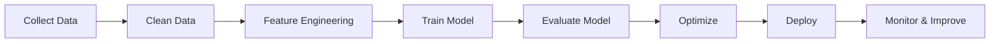

<h1 align="center">Hi 👋, I'm Kaushal Pokarne</h1>
<h3 align="center">AI | Machine Learning | Data Science | Agentic AI Enthusiast</h3>

<p align="center">
  
</p>

---

# 👨‍💻 About Me

🎓 Computer Engineering Student

🤖 Passionate about Artificial Intelligence, Machine Learning, and Data Science.

🚀 Currently exploring Agentic AI, Large Language Models (LLMs), AI Agents, and intelligent automation.

📚 I enjoy learning by building projects and experimenting with modern AI technologies.

💡 My goal is to develop AI solutions that solve real-world problems.

---

# 🚀 Current Focus

- 🤖 Agentic AI
- 🧠 Machine Learning
- 📊 Data Science
- 📈 Data Analysis
- 📝 LLM Applications
- 🔍 AI Automation
- 📚 Deep Learning Fundamentals

---

# 🌱 Currently Learning

- Agentic AI
- LangChain
- OpenAI API
- Ollama
- Retrieval-Augmented Generation (RAG)
- Prompt Engineering
- Machine Learning Algorithms
- Deep Learning

---

# 💻 Tech Stack

### 👨‍💻 Languages

<p>


</p>

---

### 📊 Data Science & Machine Learning

<p>


</p>

---

### 🤖 AI & LLMs

<p>


</p>

---

### 🛠 Tools

<p>


</p>

---

# 📂 Current Projects

- 🤖 AI Agents
- 📊 Machine Learning Models
- 📈 Data Science Projects
- 📝 Jupyter Notebook Experiments
- 🧠 LLM Applications
- 🔍 Data Analysis Workflows

---

# 📈 Learning Roadmap

```text
Python
   │
   ▼
Data Analysis
   │
   ▼
Machine Learning
   │
   ▼
Deep Learning
   │
   ▼
Large Language Models
   │
   ▼
RAG Applications
   │
   ▼
Agentic AI
   │
   ▼
Production AI Systems
```

---

# ⚙️ AI Workflow



---

# 📊 GitHub Stats

<p align="center">


</p>

---

# 🔥 GitHub Streak

<p align="center">


</p>

---

# 📈 Contribution Graph

[](https://github.com/YOUR_USERNAME)

---

# 🎯 Goals for 2026

- ✅ Build AI-powered applications
- ✅ Master Machine Learning
- ✅ Learn Deep Learning
- ✅ Build Agentic AI Projects
- ✅ Contribute to Open Source
- ✅ Publish High-Quality GitHub Repositories

---

# 💡 Quote

> **"Learn. Build. Experiment. Repeat."** 🚀

---

<p align="center">

⭐ Thanks for visiting my profile!

If you like my work, consider giving a ⭐ to my repositories.

</p>
